# Autentikasi dan Autorisasi dengan JWT

# PRAKTIKUM

1. Registrasi Pengguna
registrasi pengguna ada pada auth/register dimana endpoint ini digunakan untuk menambah pengguna baru.
Sebelum disimpan, password di-hash menggunakan bcrypt agar aman.
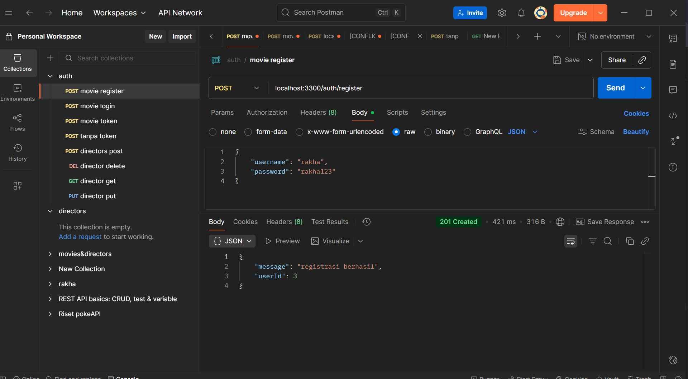

2. login pengguna
login pengguna dalam kode ada di auth/login difile server.js, yang mana digunakan untuk memverifikasi username dan password.Jika berhasil, server mengembalikan JWT token yang menjadi bukti autentikasi.
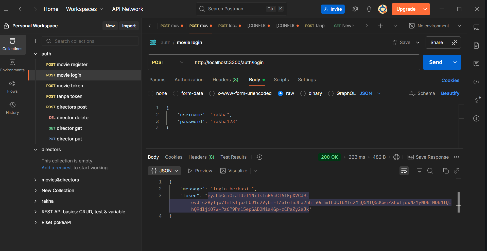
JWT dihasilkan dengan payload berisi ID dan username user.Token ini digunakan untuk mengakses endpoint yang dilindungi.

3. middleware authentikasi
File middleware/authMiddleware.js berfungsi memverifikasi token JWT di setiap permintaan ke rute yang dilindungi.
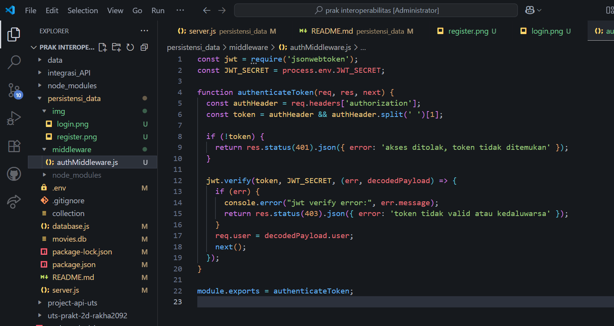
Token diverifikasi menggunakan jwt.verify(), lalu Jika token valid request lanjut ke endpoint berikutnya, Jika token invalid, API akan mengembalikan error 403.

4. endpoint movies
disini menggunakan token untuk melihat data pada movies id 1
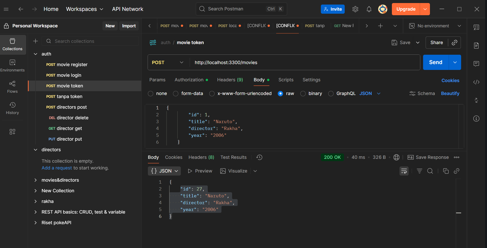
disini percobaan saat tidak menggunakan token, akses ditolak karena tidak ada token yang diterima middleware
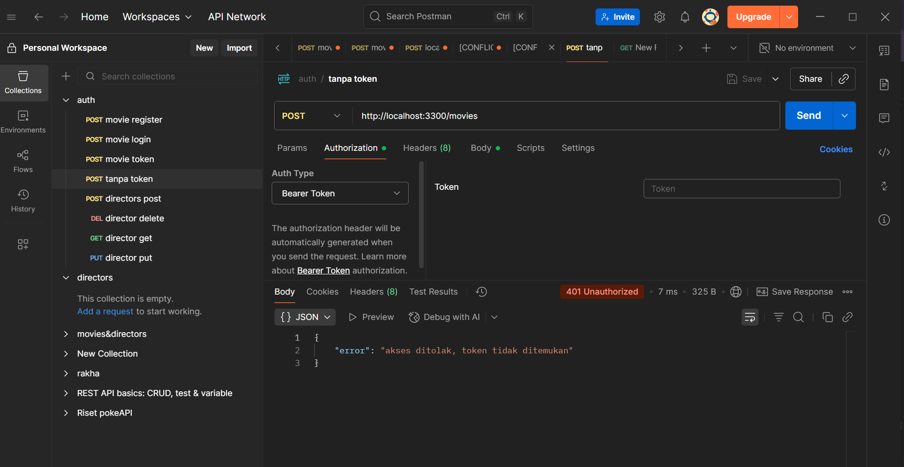

5. endpoint put dan delete
percobaan put untuk movies
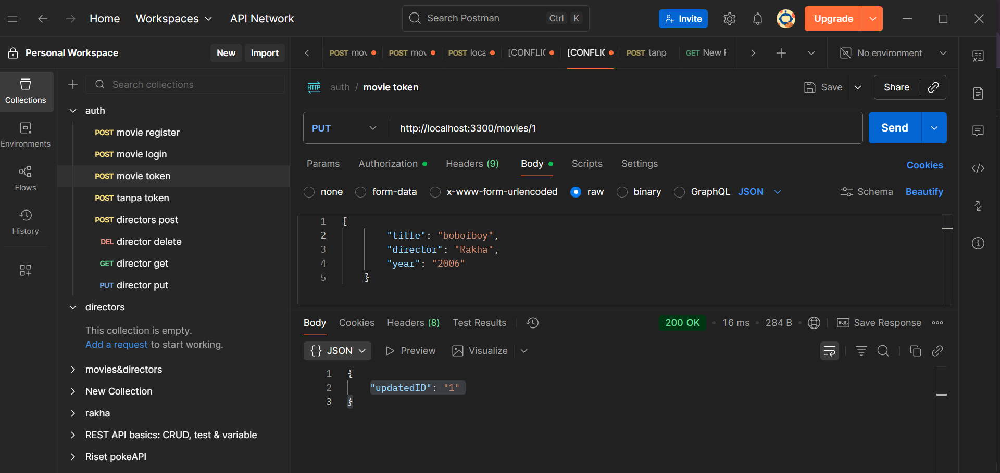
percobaan delete untuk movies
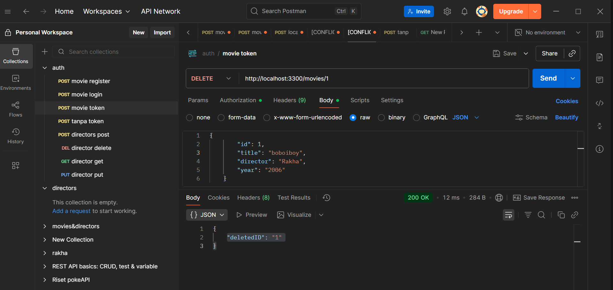

# Tugas Praktikum

1. Terapkan middleware authenticateToken ke endpoint berikut:

- POST /directors
post director menggunakan token
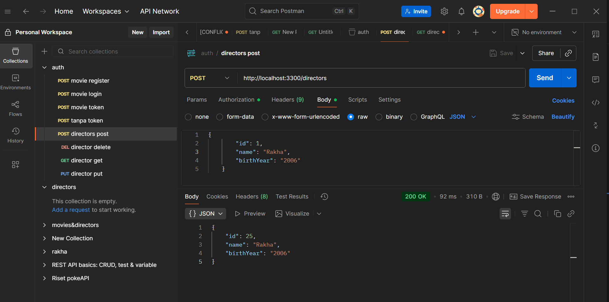
post director tanpa menggunakan token
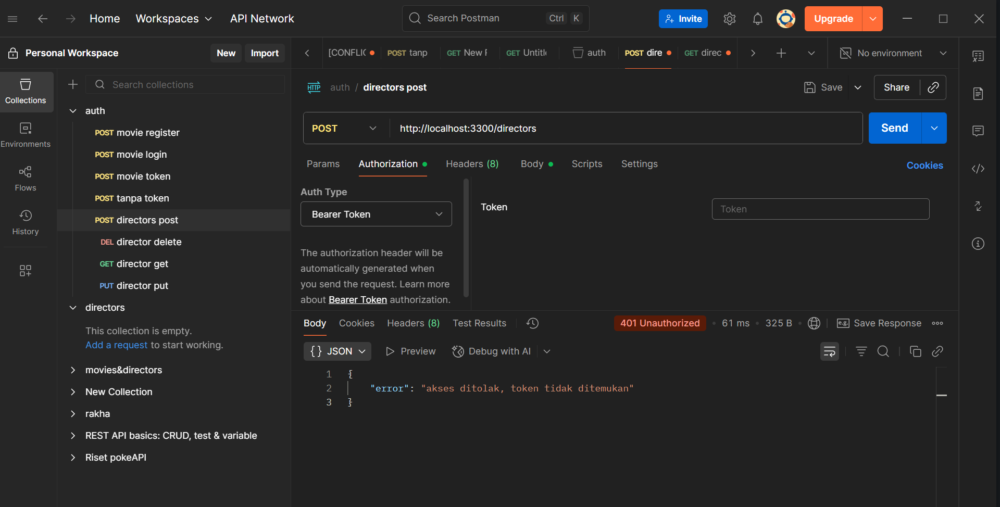

- PUT /directors/:id
put/update director menggunakan token 

put/update director tidak menggunakan token
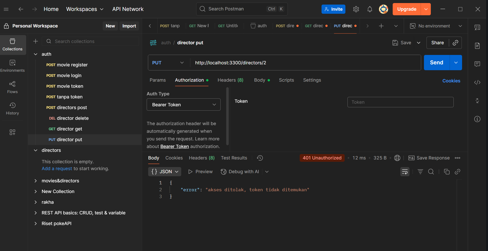

- DELETE /directors/:id
delete director menggunakan token
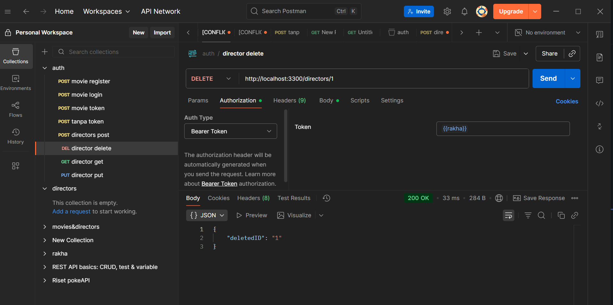
delete director tanpa token
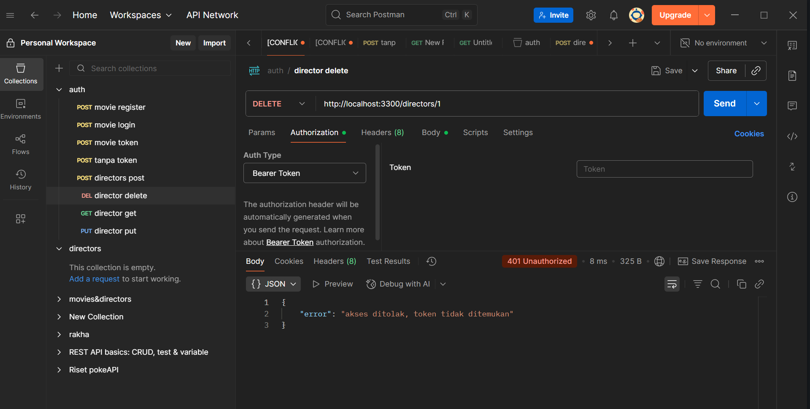

2. Biarkan endpoint GET /directors dan GET /directors/:id tetap publik.
get director untuk menampilkan data semua director
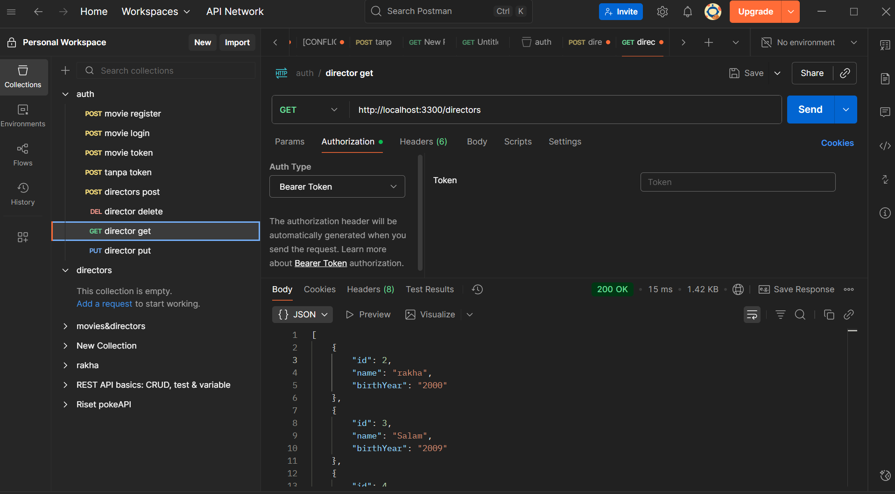
get director menurut id yang dipilih
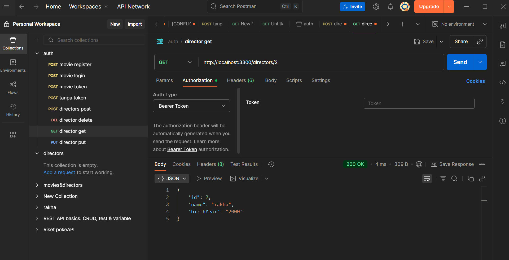